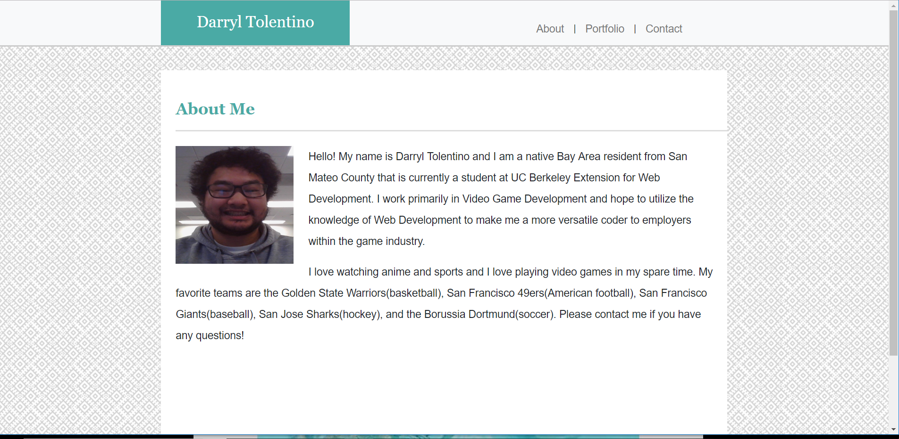
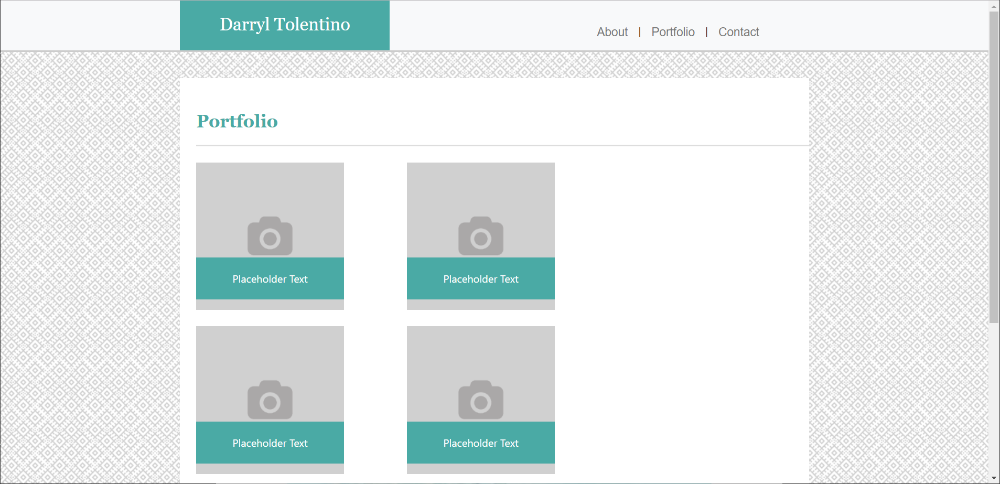
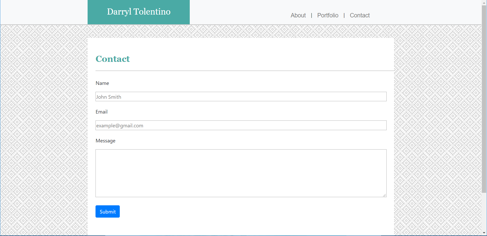

# Bootstrap-Portfolio

[Link to Github Pages Site](https://darryljltolentino.github.io/Bootstrap-Portfolio/)

This is a basic portfolio website that has three pages: an About Me, a Portfolio, and a Contact Form page. Each page has a Bootstrap Nav Bar and Grid System based on the 12 column base that Bootstrap provides and has sizing responsiveness based on browser size. The navigation bar has my name on the left as well as links that can be used to jump in between the pages using the same window. The footer is sticky so no matter how long the page gets due to content, it will always be found at the bottom.  
The About Me page has a photo of myself and a description of who I am as a developer and a person.
My Portfolio page currently has five placeholder images with placeholder text that will be linked to future projects.
The Contact Form provides a place to give a name, email, and a message field in order for someone to contact me via the website.

## Technologies Used
1) [HTML](https://developer.mozilla.org/en-US/docs/Web/HTML)
2) [CSS](https://developer.mozilla.org/en-US/docs/Web/CSS)
3) [Bootstrap](https://getbootstrap.com/)

## Versioning
1) [Github](https://github.com)